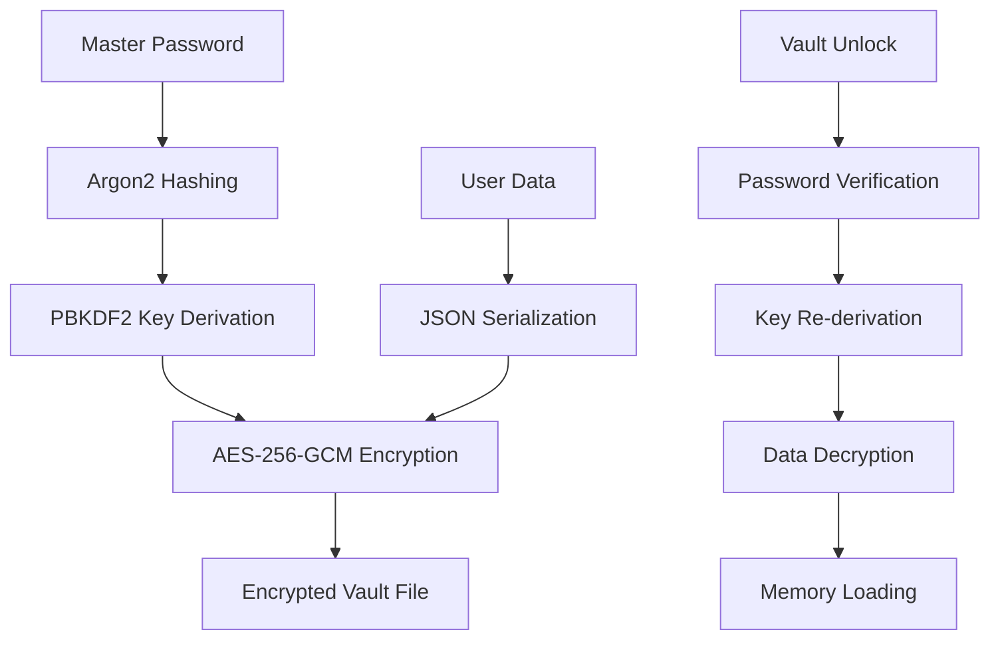

# 🔐 Obscura Vault Electron Edition

<div align="center">


**A lightning-fast, military-grade password manager with cinematic vault animations**

*The next-generation Electron evolution of my original Python/Tkinter Obscura Vault*

[🚀 Features](#-features) • [🔧 Installation](#-installation) • [🛡️ Security](#️-security) • [🏗️ Architecture](#️-architecture)

</div>

---

## 🌟 Project Evolution

> **🔄 From Desktop to Lightning:** This is the completely rebuilt **Electron version** of my original [Obscura Vault - Python/Tkinter](https://github.com/hammadmalik17/Obscura.git). While the original version provided solid desktop functionality, this Lightning Edition brings:
> - ⚡ **Modern Web UI** with stunning animations
> - 🌍 **Cross-platform compatibility** (Windows, macOS, Linux)
> - 🎬 **Cinematic vault opening/closing effects**
> - 📱 **Responsive design** and smooth interactions
> - 🚀 **Enhanced performance** with the same military-grade security

## ✨ Features

### 🔒 **Military-Grade Security**
- **AES-256-GCM Encryption** with authenticated encryption
- **Argon2 Password Hashing** (industry standard)
- **Zero-Knowledge Architecture** - your master password never leaves your device
- **Auto-lock Protection** with configurable timeout
- **Secure Memory Clearing** and clipboard auto-wipe

### 🎬 **Cinematic Experience**
- **Matrix-style Background** with falling code animation
- **3D Vault Door Animation** with realistic opening/closing effects
- **Sound Effects & Voice Feedback** for enhanced UX
- **Smooth Transitions** and micro-interactions
- **Dark Obsidian Theme** inspired by modern design

### 💾 **Comprehensive Data Management**
- 🔑 **API Keys** (OpenAI, GitHub, Google, etc.)
- 🏦 **Banking Credentials** (SBI, HDFC, ICICI with all passwords)
- 💳 **Debit/Credit Cards** with secure PIN storage
- 🔒 **Website Passwords** with auto-categorization
- 📝 **Secure Notes** for sensitive information

### ⚡ **Lightning Performance**
- **Instant Search** across all encrypted entries
- **Real-time Filtering** by type and category
- **Quick Actions** with keyboard shortcuts (Ctrl+L, Ctrl+F, Ctrl+N)
- **One-click Copy** with automatic clipboard clearing
- **Fast Startup** and responsive interactions

### 🌍 **Cross-Platform Desktop**
- **Windows** (.exe installer)
- **macOS** (.dmg package)
- **Linux** (AppImage)
- **Portable Versions** available

## 🚀 Installation

### Option 1: Download Pre-built Binary (Recommended)
```bash
# Download from Releases page - yet to release :)
https://github.com/hammadmalik17/Obscura-Electron/releases 

# Windows: Download .exe installer
# macOS: Download .dmg package  
# Linux: Download .AppImage
```

### Option 2: Build from Source
```bash
# Clone the repository
git clone https://github.com/hammadmalik17/Obscura-Electron.git
cd obscura-electron

# Install dependencies
npm install

# Install Python dependencies (for backend)
pip install cryptography argon2-cffi

# Development mode
npm run dev

# Build for production
npm run build
```

### System Requirements
- **Node.js** 16+ (for building)
- **Python** 3.8+ (bundled in release)
- **OS:** Windows 10+, macOS 10.14+, Ubuntu 18.04+


## 🛡️ Security Features

### 🔐 **Encryption Details**
```
Algorithm: AES-256-GCM (Galois/Counter Mode)
Key Derivation: PBKDF2-HMAC-SHA256 (100,000 iterations)
Password Hashing: Argon2id (memory-hard function)
Salt: 256-bit random salt per entry
Nonce: 96-bit random nonce per encryption
Authentication: Built-in authenticated encryption
```

### 🛡️ **Security Measures**
- **No Network Communication** - everything stays local
- **Encrypted File Storage** - vault files are completely encrypted
- **Memory Protection** - sensitive data cleared from RAM
- **Auto-lock Mechanism** - configurable idle timeout
- **Clipboard Security** - automatic clearing after 30 seconds
- **Session Management** - secure session handling

### 🔒 **What We DON'T Store**
- ❌ Your master password (only salted hash)
- ❌ Encryption keys (derived fresh each time)
- ❌ Any data on external servers
- ❌ Usage analytics or telemetry

## 🏗️ Architecture

### 📋 **Tech Stack**
```
Frontend: Electron + Vanilla JavaScript + CSS3
Backend: Python (cryptography, argon2-cffi)
Storage: Encrypted JSON files (.obscura format)
IPC: Electron IPC for secure communication
UI Framework: Custom CSS with CSS Grid/Flexbox
Animations: Pure CSS3 with Web Animations API
```

### 🏛️ **Project Structure**
```
obscura-vault-lightning/
├── 📁 src/
│   ├── 🔧 main.js           # Electron main process
│   ├── 🎨 index.html        # Main UI
│   ├── 🎭 styles.css        # Obsidian-inspired styling
│   ├── 🔐 auth.js          # Authentication & animations
│   ├── 💾 vault.js         # Vault management
│   ├── 🌧️ matrix.js        # Matrix background
│   └── 🐍 obscura_backend.py # Python crypto backend
├── 📁 build/               # Build resources
├── 📁 dist/                # Distribution builds
└── 📄 package.json         # Project configuration
```

### 🔄 **Data Flow**


## ⌨️ Keyboard Shortcuts

| Shortcut | Action |
|----------|--------|
| `Ctrl/Cmd + L` | Lock vault |
| `Ctrl/Cmd + F` | Focus search |
| `Ctrl/Cmd + N` | Quick add menu |
| `Escape` | Close modals |
| `Enter` | Submit forms |
| `Ctrl/Cmd + Shift + D` | Toggle debug panel (dev mode) |

## 🛠️ Development

### 🧪 **Running in Development**
```bash
# Start in development mode
npm run dev

# Enable debug features
NODE_ENV=development npm run dev

# Build for specific platform
npm run build:win    # Windows
npm run build:mac    # macOS
npm run build:linux  # Linux
```

### 🔍 **Debug Features**
- Real-time debug panel (Ctrl+Shift+D)
- Console logging for all crypto operations
- Session state monitoring
- Entry count tracking

### 🧱 **Building**
```bash
# Build all platforms
npm run build

# Build portable version
npm run build:portable

# Clean build artifacts
npm run clean
```

## 📈 Evolution from Original

### 🔄 **Original Python/Tkinter Version**
- ✅ Solid desktop functionality
- ✅ Reliable AES encryption
- ✅ Basic password management
- ❌ Limited to Python users
- ❌ Platform-specific UI quirks
- ❌ No animations or modern UX

### ⚡ **New Electron Lightning Edition**
- ✅ **Same military-grade security**
- ✅ **Cross-platform compatibility**
- ✅ **Modern web-based UI**
- ✅ **Cinematic animations**
- ✅ **Better performance**
- ✅ **Enhanced user experience**
- ✅ **Professional appearance**

## 🤝 Contributing

Contributions are welcome! This project represents the evolution of secure password management from desktop-only to modern cross-platform solutions.

### 🔧 **Areas for Contribution**
- 🎨 UI/UX improvements
- 🔒 Additional security features
- 🌍 Internationalization
- 📱 Mobile companion app
- 🔌 Browser extension integration
- 📊 Export/import features

### 📝 **Development Guidelines**
1. Maintain the same security standards as the original
2. Keep the cinematic theme and animations
3. Ensure cross-platform compatibility
4. Write comprehensive tests for crypto functions
5. Document all security-related changes

## 📄 License

MIT License - see [LICENSE](LICENSE) file for details.

## 🙏 Acknowledgments

- **Original Inspiration:** My Python/Tkinter Obscura Vault (first iteration)
- **Crypto Libraries:** Python cryptography library
- **UI Inspiration:** Obsidian, Matrix movies, modern dark themes
- **Security Standards:** OWASP guidelines for password managers

## ⚡ About the Evolution

This Electron-based Lightning Edition represents the natural evolution of my password management solution. While the **original Python/Tkinter version** provided solid functionality for desktop users, this rebuild brings modern web technologies to create a more accessible, beautiful, and performant experience while maintaining the same uncompromising security standards.

**Why Electron?** The transition to Electron allows for:
- 🌍 True cross-platform deployment
- 🎨 Modern, responsive UI design  
- ⚡ Better performance and smoother interactions
- 🔄 Easier updates and distribution
- 👥 Broader user accessibility

---

<div align="center">

**Built with ❤️ by Hammad Malik**

*Securing digital lives, one password at a time*

[⭐ Star this repo](https://github.com/hammadmalik17/Obscura-Electron) • [🐛 Report Issues](https://github.com/hammadmalik17/Obscura-Electron/issues) • [💡 Request Features](https://github.com/hammadmalik17/Obscura-Electron/discussions)

</div>